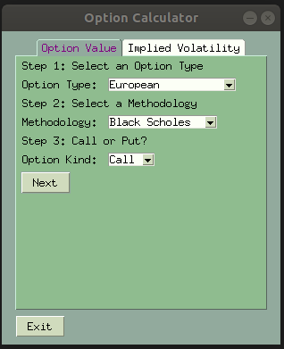
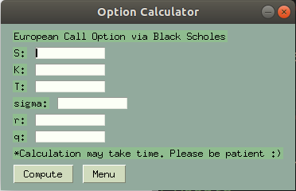
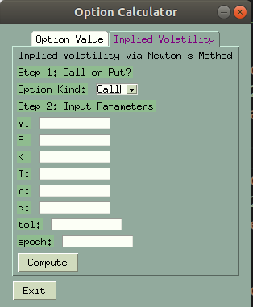

# **Option Pricer Report**


### **Contributions**

I completed this project alone.


### **UI Description**

Step 1: create an environment

```bash
conda create --name <env_name> --file requirements.txt
```

Step 2: run the UI and the application will be launched

```bash
python calculator.py
```

The UI is quite simple. After launched, you arrives at the menu. Start from the top, the 'Option Value' tab allows user to calculate option values and the 'Implied Volatility' tab allows users to calculate the implied volatility.

On the 'Option Value' tab, you select the Option Type, Methodology and Option Kind via the drop boxes. Click 'Next' to proceed to enter the parameter values.



Then click 'Compute' to obtain the option value and click 'Menu' to return to the menu.



On the other hand, to obtain the implied volatility, click the 'Implied Volatility' tab, fill in the parameters and click 'Compute' to get the implied volatility.



*Please note only the basic features are supported in the UI. Additional features are only available via calling classes and functions.

### Functionalities of Each Class/Function

```python
from pyquantfi.blackscholes import EuropeanOptionPricer
from pyquantfi.asianoptionpricer import GeometricAsianOptionPricer, ArithmeticAsianOptionPricer
from pyquantfi.basketoptionpricer import ArithmeticBasketOptionBasketPricer, GeometricBasketOptionPricer
from pyquantfi.binominaltree import BinominalTree
```

All of these classes that aim to calculate the option value contain a method **get_call_premium()** which calculates the call option value, **get_put_premium()** which calculates the put option value and **get_option_premium()** which has an argument **kind** which can either be 'C' or 'P' to return the call and put value respectively. Now these three methods may contain other arguments such as **method** which you can set the methodology.

For example,

```python
mcs_test = ArithmeticAsianOptionPricer(100, 0.3, 0.05, 3, 100, 50, 1e5, seed=2000)
# personally recommends feeding in a parameters via a dictionary
mcs_test = ArithmeticAsianOptionPricer(**param)

# for running a standard Monte Carlo simulation with Control Variate
mu_hat1 = mcs_test.get_put_premium(method='std_msc_cv')
# for running a Quasi Monte Carlo simulation with Control Variate
mu_hat2 = mcs_test.get_put_premium(method='quasi_msc_cv')
```

**EuropeanOptionPricer** calculates an European option values using the closed form Blackscholes formula.

**BinominalTree** calculates an American option values and European option values using the binominal tree method.

**GeometricAsianOptionPricer** calculates the Geometric Asian option values using closed form formula or the monte carlo simulation.

**ArithmeticAsianOptionPricer** calculates the Arithmetic Asian option values using monte carlo simulation with or without control variate.

**GeometricBasketOptionBasketPricer** calculates the Geometric basket option values using closed form formula or the monte carlo simulation. This supports basket options can support over 2 assets as well. For over 2 assets, the input of rhos must be a numpy array n x n correlation matrix for n assets.

**ArithmeticBasketOptionBasketPricer** calculates the Arithmetic basket option values using monte carlo simulation with or without control variate. This supports basket options can support over 2 assets as well. For over 2 assets, the input of rhos must be a numpy array n x n correlation matrix for n assets.


### Test Case and Analysis

The result of the test cases can be found by running the following scripts

```bash
python official_test_asian.py
python official_test_basket.py

# also saved the results in txt files for easy viewing
python official_test_asian.py > asian.txt
python official_test_basket.py > basket.txt
```

#### Asian Options Analysis

As the value of n decreases, the geometric and arithmetic Asian option values decrease, no matter it is a call option or a put option.

As the value of sigma increases, the geometric and arithmetic Asian option values also increases, no matter it is a call option or a put option.


#### Basket Options Analysis

As the rho increases, there is a more positive correlation between the two assets and the prices of the geometric and arithmetic basket option increases, no matter it is a call option or a put option.

When the sigma of one of assets decreases, the prices of the geometric and arithmetic basket option also decreases, no matter it is a call option or a put option.

When the strike price of options decreases, the prices of the geometric and arithmetic basket option also decreases for a put option. However the prices of the geometric and arithmetic basket option would increase for a call option.

Oppositely, when the strike price of options increases, the prices of the geometric and arithmetic basket option also increases for a put option. However the prices of the geometric and arithmetic basket option would decrease for a call option.

When the sigmas of two of assets decreases, the prices of the geometric and arithmetic basket option increases, no matter it is a call option or a put option.


You can also run this

```bash
python test.py
```

and this will show you some test results of the program. This includes test results for pricing basket options of 3 assets as well as quasi monte carlo option pricing.


### Extension Implemented

- Price options on a basket with more than two assets
  - As mentioned above, the rhos input must be a numpy array n x n correlation matrix for n assets.
- Quasi Monte Carlo Simulation
- Binomial Tree that supports European Option pricing
- GPU acceleration implemented in C++ (Please refer to example)

